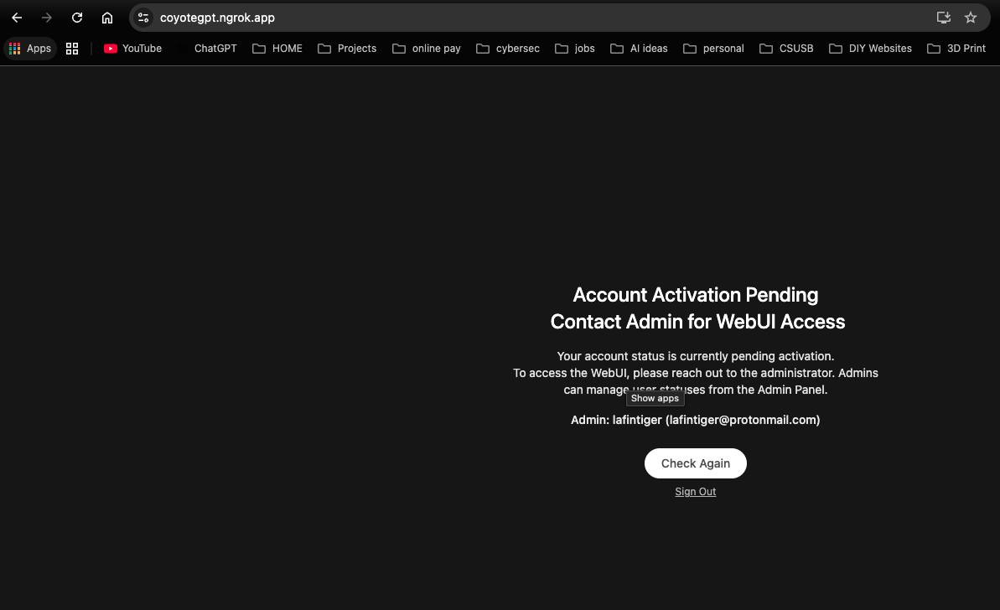

# 🛡️ Ethical Hacking Toolkit

> A multi-tool reconnaissance & security analysis suite — built as a semester project for **CSUSB IST-4620: Penetration Testing**.

Five common ethical-hacking utilities bundled into a single, easy-to-use Gradio web interface. Run locally, share publicly with one click.



---

## ✨ Features

| Tool | Description |
| --- | --- |
| 🔍 **Port Scanner** | Concurrent TCP scan of 16 common service ports (SSH, HTTP, SMB, RDP, etc.) |
| 🌐 **HTTP Header Scanner** | Audits a URL for missing security headers (CSP, HSTS, X-Frame-Options, …) |
| 🔐 **Hash Identifier** | Detects MD5, SHA-1, SHA-256, SHA-512, bcrypt, Argon2, and more |
| 🔑 **Password Strength** | Calculates entropy in bits and checks against a common-passwords list |
| 🌍 **Subdomain Finder** | DNS-based subdomain enumeration with a built-in wordlist |

---

## 🚀 Quick Start

```bash
# 1. Clone
git clone https://github.com/jruggles656/csusb-coursework.git
cd csusb-coursework/IST-4620-security-tools/ethical-hacking-toolkit

# 2. Install
pip3 install -r requirements.txt

# 3. Run
python3 tool.py
```

The terminal will print:
- 🖥️ a **local URL** (`http://127.0.0.1:7860`) — for use on your machine
- 🌎 a **public share link** (`https://xxxxx.gradio.live`) — valid for 72 hours

---

## 🧰 Tech Stack

- 🐍 **Python 3** — standard library (`socket`, `hashlib`, `concurrent.futures`)
- ⚡ **Gradio** — web UI + public share-link tunneling
- 📡 **Requests** — HTTP header inspection

---

## ⚖️ Legal & Ethics

> ⚠️ **For authorized testing only.**
>
> Use this tool against systems you own or have **explicit written permission** to test. Unauthorized port scanning, subdomain enumeration, or any form of probing is illegal under the **Computer Fraud and Abuse Act (CFAA)** in the United States and equivalent laws elsewhere.

Recommended safe targets for testing:
- 🎯 `scanme.nmap.org` — Nmap's official authorized test host
- 🏠 your own home network (`192.168.x.x`)
- 🌐 your own domains

---

## 📁 Project Structure

```
ethical-hacking-toolkit/
├── tool.py            # main app (5 tools + Gradio UI)
├── requirements.txt   # pip dependencies
├── README.md          # this file
└── docs/
    └── screenshot.png
```

---

## 👤 Author

**James Ruggles** — CSUSB Information Systems & Technology
🎓 IST-4620 · Spring 2026
